## Project Description

This project consists of an identity service developed in Node.js. The identity service is responsible for managing user authentication and authorization in web applications, ensuring security and reliability.

## Class Diagram

```mermaid

classDiagram

class AuthorizationRepository{
            -_cacheManager: CacheInterface
            +create() Promise~AuthorizationEntity~
+delete() Promise~boolean~
+findAll() Promise~AuthorizationEntity[]~
+findOne() Promise~AuthorizationEntity~
+findOneByUuid() Promise~AuthorizationEntity~
+update() Promise~AuthorizationEntity~
+findPermissionsByUserUuid() Promise~AuthorizationEntity~
-_findRbacPermissionsByUserUuid() Promise~RbacEntity~$
-_findAbacPermissionsByUserUuid() Promise~AbacEntity~$
        }
AuthorizationRepositoryInterface<|..AuthorizationRepository
class RbacRepository{

            +getPermissions() Promise~PermissionEntity[]~
+getRoles() Promise~RoleEntity[]~
+create() Promise~RbacRepositoryInterface~
+delete() Promise~boolean~
+findAll() Promise~RbacRepositoryInterface[]~
+findOne() Promise~RbacRepositoryInterface~
+findOneByUuid() Promise~RbacRepositoryInterface~
+update() Promise~RbacRepositoryInterface~
+createRole() Promise~RoleEntity~
+createPermission() Promise~PermissionEntity~
        }
RbacRepositoryInterface<|..RbacRepository
class CacheManager{
            -_client: CacheInterface

        }
class CacheInterface {
            <<interface>>

            +get() any
+set() void
+delete() void
+clear() void
        }
class DatabaseHandler{
            -_handler: DatabaseInterface

        }
class DatabaseHandlers {
        <<enumeration>>
        SQLITE
POSTGRES
      }
class DatabaseInterface {
            <<interface>>

            +init() Sequelize
        }
class LogHandler{
            -instance: any$
            +getInstance() LogInterface$
        }
class LogInterface {
            <<interface>>
            +log: (message: string, level?: string) =~ void
+info: (message: string) =~ void
+error: (message: string) =~ void

        }
class UserRepository{

            +create() Promise~UserEntity~
+delete() Promise~boolean~
+findAll() Promise~UserEntity[]~
+findOne() Promise~UserEntity~
+findOneByUuid() Promise~UserEntity~
+findByEmailOrFail() Promise~UserEntity~
+findByUsernameOrFail() Promise~UserEntity~
+update() Promise~UserEntity~
        }
UserRepositoryInterface<|..UserRepository
class BaseEntity{
            #_createdAt: Date
#_updatedAt: Date
#_deletedAt: Date
#_isActive: boolean
            +toJSON() Record~string, unknown~
        }
class BaseRepositoryInterface~T~ {
            <<interface>>
            +create: (entity: T) =~ Promise~T~
+update: (entity: T) =~ Promise~T~
+delete: (entity: T) =~ Promise~boolean~
+findOne: (entity: T) =~ Promise~T~
+findOneByUuid: (uuid: string) =~ Promise~T~
+findAll: () =~ Promise~T[]~

        }
class AuthenticationEntity{
            -_user: UserEntity
-_session: Session

        }
class Session {
            <<interface>>
            +token: string

        }
class AuthenticationService{
            -_userService: UserService
            +authenticate() Promise~AuthenticationEntity~
        }
class AuthorizationEntity{
            -_rbac: RbacEntity
-_abac: AbacEntity

        }
class AuthorizationTypes {
            <<interface>>
            +rbac: RbacEntity
+abac?: AbacEntity

        }
class AuthorizationRepositoryInterface {
            <<interface>>

            +findPermissionsByUserUuid() Promise~AuthorizationEntity~
        }
BaseRepositoryInterface~T~<|..AuthorizationRepositoryInterface
class RbacRepositoryInterface {
            <<interface>>

            +getPermissions() Promise~any~
+getRoles() Promise~any~
        }
BaseRepositoryInterface~T~<|..RbacRepositoryInterface
class AuthorizationService{
            -_authorizationRepository: AuthorizationRepository
            +checkPermission() Promise~boolean~
+checkPolicy() Promise~boolean~
        }
class RbacService{
            -_rbacRepository: RbacRepository
            +getPermissions() Promise~PermissionEntity[]~
+getRoles() Promise~RoleEntity[]~
+createRole() Promise~RoleEntity~
+createPermission() Promise~PermissionEntity~
        }
class UserEntity{
            -_uuid: string
-_name: string
-_username: string
-_email: string
-_password: string
-_authorization: AuthorizationEntity
            +create() Promise~this~
+from() UserEntity$
-validate() void
+checkPassword() Promise~boolean~
+hashPassword() Promise~void~
        }
BaseEntity<|--UserEntity
class UserRepositoryInterface {
            <<interface>>
            +findByEmailOrFail: (email: string) =~ Promise~UserEntity~
+findByUsernameOrFail: (username: string) =~ Promise~UserEntity~

        }
BaseRepositoryInterface~T~<|..UserRepositoryInterface
class UserService{
            -_userRepository: UserRepository
-_authorizationRepository: AuthorizationRepository
            +createUser() Promise~UserEntity~
+updateUser() Promise~UserEntity~
+findUserWithPermissions() Promise~UserEntity~
+findUserByEmail() Promise~UserEntity~
+findUserByUsername() Promise~UserEntity~
+findAll() Promise~UserEntity[]~
+findByUuid() Promise~UserEntity~
        }
class RedisClient{
            -_client: Redis
            +clear() Promise~"OK"~
+delete() Promise~number~
+get() Promise~string~
+set() void
        }
CacheInterface<|..RedisClient
class Postgres{
            -instance: Sequelize$
            +getInstance() Sequelize$
+init() Sequelize
        }
DatabaseInterface<|..Postgres
class Sqlite{
            -instance: Sequelize$
            +getInstance() Sequelize$
+init() Sequelize
        }
DatabaseInterface<|..Sqlite
class AbacEntity{
            -_policies: AccessPolicyEntity[]
            +checkPolicy() boolean
+from() AbacEntity$
        }
BaseEntity<|--AbacEntity
class AccessPolicyEntity{
            -_actions: ActionEntity[]
-_userAttributes: AttributeEntity[]
-_resourceAttributes: AttributeEntity[]
            +checkPolicy() boolean
+from() AccessPolicyEntity$
        }
class ActionEntity{
            -_name: string
            +from() ActionEntity$
        }
class AttributeEntity{
            -_name: string
-_value: string
            +from() AttributeEntity$
        }
class ResourceEntity{
            -_name: string

        }
class PermissionEntity{
            -_id: number
-_name: string
            +from() PermissionEntity$
        }
class PermissionParams {
            <<interface>>
            +id: number
+name: string

        }
BaseEntity<|--PermissionEntity
class RbacEntity{
            -_roles: RoleEntity[]
            +from() RbacEntity$
+checkPermission() boolean
        }
class RbacParams {
            <<interface>>
            +roles: RoleEntity[]

        }
BaseEntity<|--RbacEntity
class RoleEntity{
            -_id: number
-_name: string
-_permissions: PermissionEntity[]
            +from() RoleEntity$
        }
class RoleParams {
            <<interface>>
            +id: number
+name: string
+permissions: PermissionEntity[]

        }
BaseEntity<|--RoleEntity
```

## Features

- User registration
- User authentication (login)
- Authorization

